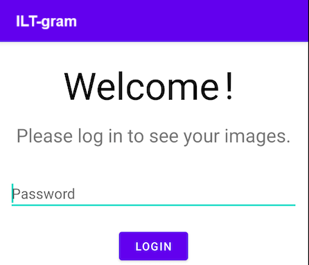

    <h2>ILT-gram Android App</h2>
  

This is an Android app with intentionally built-in security vulnerabilities.

## Setup

Simply open and build the project in your favorite version of Android Studio.

## What the App Does

ILT-gram is like Instagram, except only you have access to your
images. The app always asks for your password before it opens your secret gallery, which means
not even other users of the phone can get access to them (or can they?).

## The Challenge

You have access to a (non-rooted) phone with an installation of Finstergram, but while you can
unlock the phone, you do not have the password to unlock the app.

  

## Based on app from:

* [Jonas Mayer](https://www.linkedin.com/in/jonas-mayer-aa9bba200/)
* [Florentin Wieser](https://www.linkedin.com/in/fwieser/)